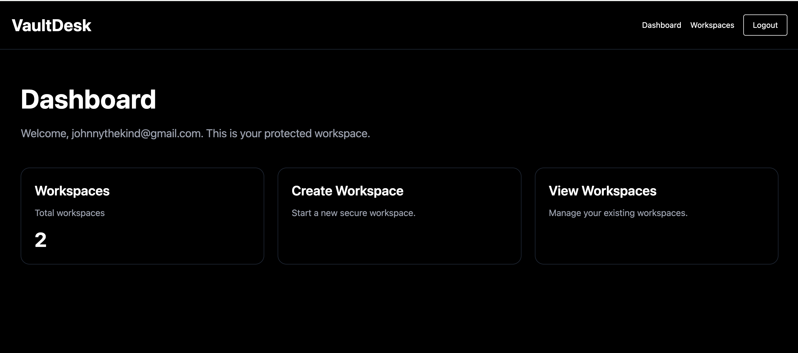
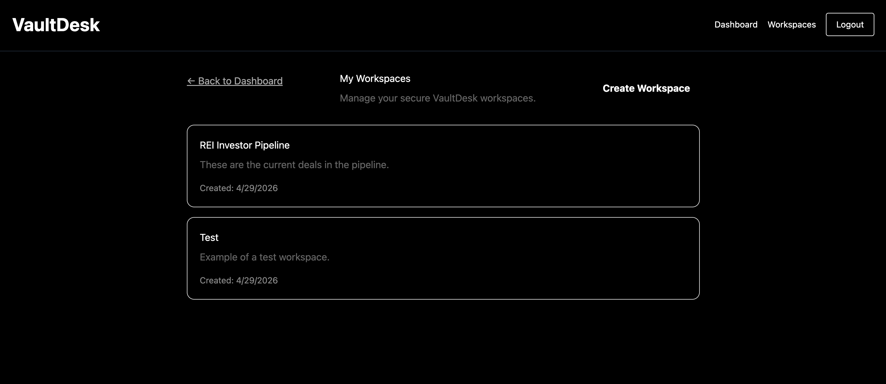
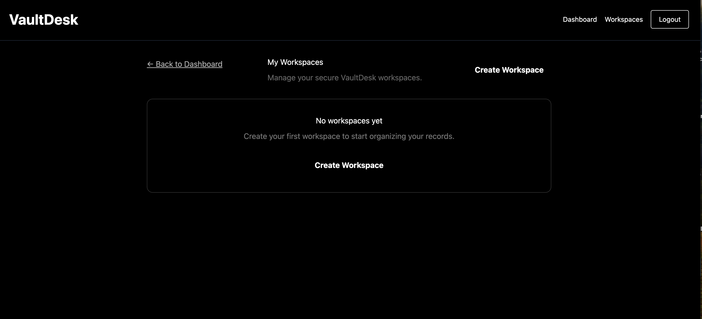
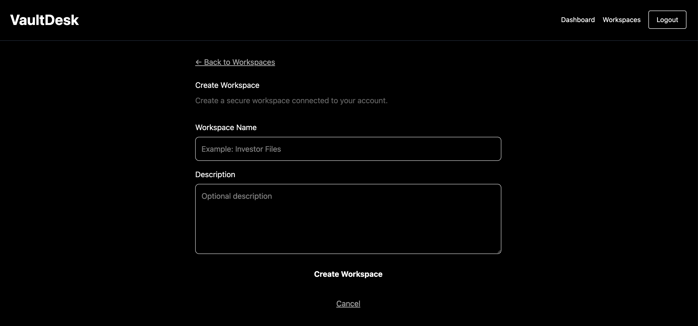
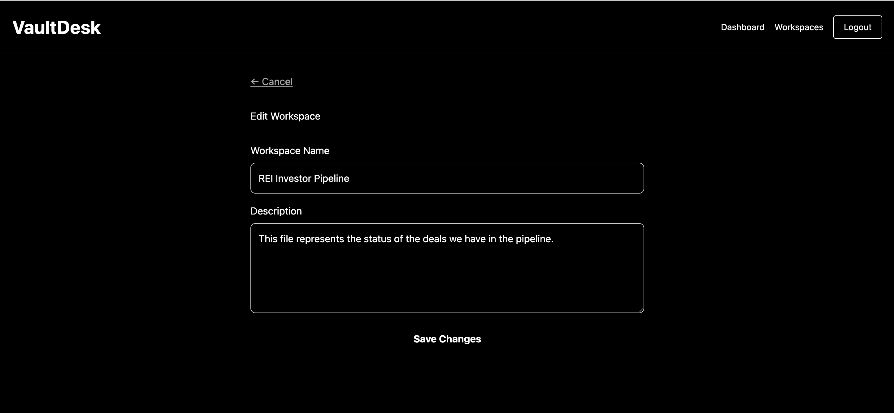
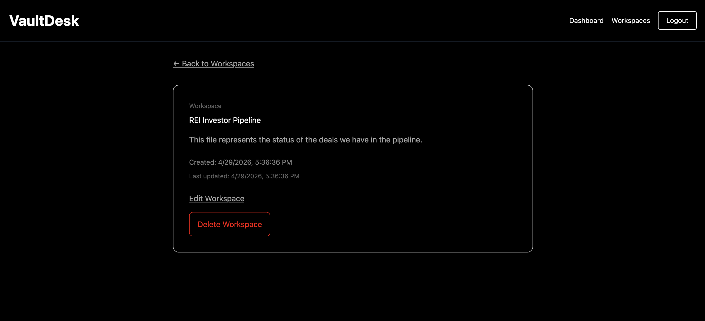
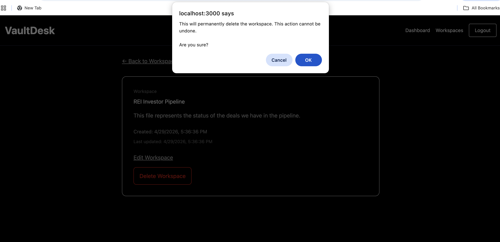
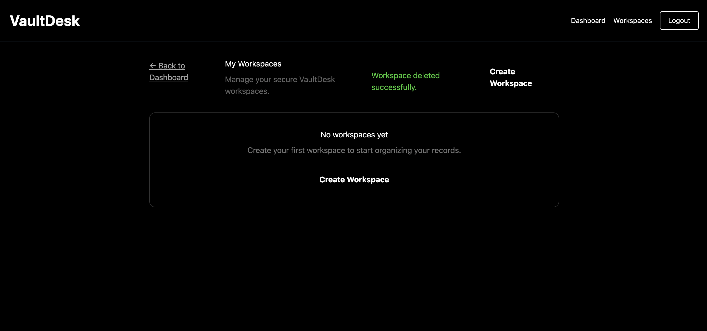

## 🌐 Live Demo
https://vaultdesk-two.vercel.app

## 💻 GitHub Repo
https://github.com/johnnythekind-ux/vaultdesk

# VaultDesk

VaultDesk is a secure workspace management application built with Next.js, Supabase, and Vercel. It gives authenticated users a private place to create, view, update, and delete workspace records while keeping each user’s data isolated.

This project was built to demonstrate real-world SaaS fundamentals: protected routes, Supabase authentication, database-backed CRUD operations, user-scoped data access, production deployment, and clean UI feedback.

## 🚀 Overview

VaultDesk is built around a core SaaS pattern:

**Auth → User → Data → CRUD → Feedback**

Users authenticate via Supabase, which establishes identity and enables secure, user-scoped queries. Every database operation is filtered at the row level using RLS (Row Level Security), ensuring strict data isolation.

The application supports full CRUD workflows on workspace records, with server-side handling through Next.js and real-time UI feedback for user actions (create, update, delete).

This structure mirrors production-grade application design, where authentication, authorization, and data ownership are tightly enforced across the system.

---

## ✨ Features

- 🔐 **Authentication System** — Supabase Auth with protected routes and session handling  
- 🧱 **Workspace CRUD Engine** — Full create, read, update, delete lifecycle for user-owned data  
- 🔒 **Data Isolation (RLS)** — Every query scoped to the authenticated user via Row Level Security  
- ⚙️ **Server-Side Logic** — Next.js server actions handle secure data operations  
- 💬 **UX Feedback System** — Real-time success messaging for user actions  
- ⚠️ **Destructive Action Safeguards** — Confirmation modal prevents accidental deletes  
- 🧭 **State-Aware UI** — Handles empty, populated, and post-action states cleanly  
- 🕓 **Audit-Friendly Data** — Created and updated timestamps for tracking changes  

---

## 🧠 What This Project Demonstrates

This project demonstrates real-world full-stack engineering capability, including:

- 🧱 **End-to-End System Design** — Building a complete flow from authentication to database persistence to UI feedback  
- 🔐 **Security-First Thinking** — Enforcing user-level data isolation using Supabase Row Level Security (RLS)  
- ⚙️ **Backend + Frontend Integration** — Connecting Next.js server actions with a reactive UI layer  
- 📊 **State Management Awareness** — Handling loading, success, empty, and destructive states cleanly  
- 🧩 **Reusable Architecture Patterns** — Applying a repeatable SaaS structure (Auth → Data → CRUD → Feedback)  
- 🚀 **Production Deployment Readiness** — Structuring the app for deployment on Vercel with environment configuration  

This is not a tutorial-style build — it reflects how modern SaaS applications are actually structured in production environments.

---

## ⚙️ Tech Stack

- Next.js (App Router)
- Supabase (Auth + Database)
- TypeScript
- Tailwind CSS
- Vercel (Deployment)

---

## 📸 Screenshots

### Dashboard


### Workspaces List


### Empty State


### Create Workspace


### Edit Workspace


### Workspace Detail


### Delete Confirmation


### Post Delete State


---

## ⚙️ Local Development

Clone the repository:

```bash
git clone https://github.com/YOUR_USERNAME/vaultdesk.git
cd vaultdesk
```

Install dependencies:

```bash
npm install
```

Create a `.env.local` file:

```env
NEXT_PUBLIC_SUPABASE_URL=your_url
NEXT_PUBLIC_SUPABASE_PUBLISHABLE_KEY=your_key
SUPABASE_SERVICE_ROLE_KEY=your_service_role_key
```

Run the development server:

```bash
npm run dev
```

---

## 🔐 Database Design

Core table:

### workspaces

- id
- user_id
- name
- description
- created_at
- updated_at

All queries are scoped using:

```ts
.eq("user_id", user.id)
```

This ensures users can only access their own data.

---

## 🔁 System Pattern

This project is built using a reusable SaaS architecture pattern:

**Auth → Identity → Data Access → CRUD Operations → UI Feedback**

- **Auth** — Supabase handles authentication and session management  
- **Identity** — Each request is tied to a verified user  
- **Data Access** — Queries are scoped using Row Level Security (RLS)  
- **CRUD Operations** — Users perform actions on their own records only  
- **UI Feedback** — The interface reflects success, failure, and state changes in real time  

This pattern is intentionally modular and can be extended into additional systems such as:

- Deal pipelines  
- Report generation systems (e.g., ReportForge)  
- Contract management tools  
- CRM-style data tracking modules  

It reflects how scalable SaaS products are structured — with clear separation between authentication, data ownership, and user interaction layers.

---

## 🚧 Future Improvements

- File uploads / document storage
- Search and filtering
- Pagination for scalability
- Enhanced UI styling (Tailwind / design system)
- Role-based access (multi-user workspaces)
- Integration with external modules (e.g., ReportForge)

---

## 🧩 Role in Larger System

VaultDesk is designed as a foundational module for a larger platform (AppStack OS), where it will serve as the central storage and organization layer for outputs generated by other tools.

---

## 📌 Summary

VaultDesk is a production-ready training application that demonstrates full-stack development skills, secure data handling, and scalable architecture design.

It represents a foundational building block for future modular platforms and integrated SaaS systems.